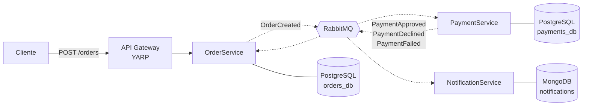

# Sistema de Pedidos — Microsserviços .NET 8 + RabbitMQ

Sistema de pedidos de e-commerce em microsserviços, com comunicação por eventos
assíncronos no RabbitMQ. O pedido é aceito imediatamente, a cobrança acontece
depois e o cliente é notificado quando houver resultado.

> Status: em construção, 8 de 28 tarefas concluídas. O `OrderService` já aceita
> um pedido por `POST /orders`, persiste no PostgreSQL e publica `OrderCreated`
> pelo padrão outbox — inclusive com o RabbitMQ fora do ar. O `PaymentService` e
> o `NotificationService` ainda não consomem nada. O [roadmap](#roadmap) mostra
> o andamento.

---

## O problema

O cliente não pode ficar esperando a confirmação de um pagamento que depende de
um processador externo, pode demorar ou pode não responder. O sistema precisa
aceitar o pedido na hora e resolver a cobrança depois, sem perder nada no
caminho. É um cenário de consistência eventual.

## Arquitetura

Três serviços de domínio se comunicam apenas por eventos. Não há orquestrador:
cada serviço reage a fatos que já aconteceram. Esse modelo se chama coreografia.



1. O cliente cria o pedido e recebe de imediato o identificador e a situação
   `Pending`, sem esperar pelo pagamento.
2. `OrderService` persiste o pedido e publica `OrderCreated`.
3. `PaymentService` consome, decide a cobrança e publica um dos três desfechos.
4. `OrderService` consome o desfecho e move o pedido para o estado final.
5. `NotificationService` consome o mesmo desfecho, em paralelo, e registra a
   notificação.

Nenhum serviço acessa o banco de outro. Um schema compartilhado acoplaria os
serviços no nível dos dados e tiraria a possibilidade de evoluí-los em separado.

## Decisões técnicas

### Outbox

Salvar o pedido no PostgreSQL e publicar `OrderCreated` no RabbitMQ são duas
operações em sistemas diferentes. Se a segunda falha depois da primeira, o
pedido existe e ninguém fica sabendo, e o sistema fica inconsistente sem gerar
erro.

O evento é gravado na mesma transação do pedido, numa tabela `outbox`, e um
processo separado publica a partir dali.

Isso já é verificável: com o RabbitMQ parado, o `POST /orders` continua
respondendo `201` e o evento fica esperando na tabela `outbox_message`. Quando o
broker volta, a linha some da tabela e a mensagem aparece no exchange, sem
nenhuma intervenção.

### Consumidores idempotentes

RabbitMQ garante entrega pelo menos uma vez, então mensagem repetida é um caso
normal: basta um `ack` se perder para a mesma mensagem chegar de novo.

Cada consumidor registra o `MessageId` no Redis e descarta o que já processou.
Como garantia adicional, o banco tem restrições únicas (`payments.order_id`,
`notifications.orderId`), então o comportamento continua correto mesmo se o
Redis ficar indisponível.

### Tratamento de falhas

Retry com backoff exponencial e dead-letter queue em todo consumidor. Mensagem
que falhou 5 vezes vai para a DLQ e gera log de erro, em vez de ser descartada
ou reentregue indefinidamente.

O domínio separa pagamento recusado (o processador respondeu "não", é decisão de
negócio) de pagamento falhou (o processador não respondeu, é problema técnico).
A ação de suporte é diferente em cada caso.

### Rastreabilidade

Todo evento carrega um `CorrelationId` que nasce no gateway e atravessa a cadeia
inteira, o que permite seguir um fluxo assíncrono de três saltos nos logs.

## Stack

| Item | Escolha |
|---|---|
| Runtime | .NET 8 (LTS) |
| Mensageria | RabbitMQ via MassTransit |
| Banco transacional | PostgreSQL + EF Core (bancos separados por serviço) |
| Banco documental | MongoDB (histórico de notificações) |
| Cache / idempotência | Redis |
| Gateway | YARP |
| Logs | Serilog estruturado, saída JSON |
| Testes | xUnit + FluentAssertions + Testcontainers |
| Orquestração local | Docker Compose |

MassTransit em vez de `RabbitMQ.Client` puro porque já traz retry, DLQ,
serialização e outbox prontos, o que evita reimplementar essa camada à mão.

Dois tipos de banco porque os padrões de acesso são diferentes: Orders e
Payments precisam de transação e integridade referencial; Notifications é
histórico append-only, com formato que varia por canal.

## Rodando localmente

Requisitos: Docker e .NET 8 SDK.

```bash
git clone https://github.com/rafacavalcante60/microservices-rabbitmq.git
cd microservices-rabbitmq

# Sobe RabbitMQ, PostgreSQL, MongoDB e Redis
docker compose up -d

# Testes de domínio, rodam sem infraestrutura
dotnet test
```

Painel do RabbitMQ: <http://localhost:15672> (`guest` / `guest`)

Com a infraestrutura de pé, o serviço de pedidos roda direto pelo SDK:

```bash
dotnet run --project src/OrderService --urls http://localhost:8081

curl -X POST localhost:8081/orders \
  -H 'Content-Type: application/json' \
  -d '{
    "customerId": "11111111-1111-1111-1111-111111111111",
    "items": [
      {"productId":"22222222-2222-2222-2222-222222222222","productName":"Teclado","quantity":2,"unitPrice":10.00},
      {"productId":"33333333-3333-3333-3333-333333333333","productName":"Mouse","quantity":3,"unitPrice":5.00}
    ]
  }'
# 201 → {"orderId":"…","status":"Pending","totalAmount":35.00}
```

O total nasce da soma dos itens: um `totalAmount` enviado no corpo não é lido,
porque o campo não existe no contrato de entrada.

> Os serviços ainda não sobem pelo Compose, isso chega na T-022. O pedido também
> ainda não sai de `Pending`: quem o move é o desfecho do pagamento, na T-018.

## Estrutura

```
├── specs/                   # spec, plano e tarefas de cada feature
├── src/
│   ├── Shared.Contracts/    # contratos de evento, sem dependências
│   ├── ApiGateway/
│   ├── OrderService/        # + OrderService.Domain
│   ├── PaymentService/      # + PaymentService.Domain
│   └── NotificationService/
├── tests/
└── docker-compose.yml
```

Cada serviço segue `Api` → `Application` → `Domain` ← `Infrastructure`, com as
dependências apontando para dentro. O domínio é um projeto separado sem nenhum
`PackageReference`, então um `using` de EF Core nas regras de negócio não
compila.

## Roadmap

| Etapa | Tarefas | Status |
|---|---|---|
| Fundação — solução, Docker Compose, contratos | T-001 → T-003 | ✅ |
| Domínio de pedidos | T-004 → T-005 | ✅ |
| OrderService — persistência, outbox, `POST /orders` | T-006 → T-008 | ✅ |
| OrderService — idempotência, consulta, observabilidade | T-009 → T-011 | ⬜ |
| PaymentService — regra, retry, consumidor | T-012 → T-017 | ⬜ |
| Fluxo completo ponta a ponta | T-018 | ⬜ |
| Notificações e API Gateway | T-019 → T-021 | ⬜ |
| Tudo em contêineres | T-022 | ⬜ |
| Testes de integração com Testcontainers | T-023 → T-026 | ⬜ |
| ADRs e documentação | T-027 → T-028 | ⬜ |

## Como este projeto é construído

Desenvolvimento spec-driven: nenhuma linha de código de produção é escrita antes
de existir uma spec aprovada e um plano derivado dela.

```
spec (o quê e por quê) → plano (como) → tarefas → código → teste verde
```

- [`specs/001-pedido-pagamento-notificacao/spec.md`](specs/001-pedido-pagamento-notificacao/spec.md) — 15 regras de negócio e 16 critérios de aceite, em linguagem de negócio
- [`specs/001-pedido-pagamento-notificacao/plan.md`](specs/001-pedido-pagamento-notificacao/plan.md) — cada decisão técnica com a justificativa e a alternativa descartada

Um commit por tarefa concluída.
