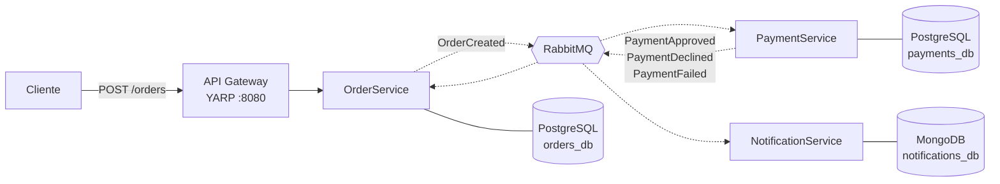

# Sistema de pedidos: microsserviços .NET 8 + RabbitMQ

Um pedido de e-commerce atravessa três serviços que só conversam por eventos no
RabbitMQ. O cliente recebe a resposta na hora, a cobrança acontece depois, e a
notificação chega quando houver resultado.

O projeto é pequeno de propósito. Ele existe para mostrar que os problemas de
sistemas distribuídos foram tratados, não para ter muitas funcionalidades:
evento que se perde entre o banco e o broker, mensagem entregue duas vezes,
cliente que clica duas vezes no botão, processador de pagamento que não
responde, broker fora do ar no meio da operação.

## O que acontece quando alguém cria um pedido



1. O `OrderService` valida, grava o pedido e responde `201 Pending`. O cliente
   termina aqui, sem esperar pela cobrança.
2. Na mesma transação da gravação, o evento `OrderCreated` vai para a tabela
   outbox. Um processo separado publica no RabbitMQ.
3. O `PaymentService` consome, decide a cobrança (acima de R$ 10.000,00 recusa)
   e publica um dos três desfechos.
4. O `OrderService` consome o desfecho e move o pedido para o estado final.
5. O `NotificationService` consome o mesmo desfecho, em paralelo, e registra a
   notificação.

Os passos 4 e 5 não têm ordem entre si. Por alguns milissegundos existe uma
notificação de pagamento aprovado enquanto o pedido ainda consta `Pending`. Isso
é consistência eventual, e é intencional: encadear os dois traria de volta o
acoplamento síncrono que a arquitetura evita.

Nenhum serviço chama outro por HTTP, e nenhum lê o banco do outro.

Detalhes em [`docs/architecture.md`](docs/architecture.md).

## Rodando

Requisitos: Docker e .NET 8 SDK.

```bash
git clone https://github.com/rafacavalcante60/microservices-rabbitmq.git
cd microservices-rabbitmq
docker compose up --build
```

Isso sobe RabbitMQ, PostgreSQL, MongoDB, Redis e os quatro serviços .NET. As
migrations rodam sozinhas no startup, e o compose espera cada dependência ficar
saudável antes de subir quem depende dela. Na primeira vez o build das imagens
leva alguns minutos.

Quando terminar:

- API pelo gateway: <http://localhost:8080>
- Painel do RabbitMQ: <http://localhost:15672>, usuário `guest`, senha `guest`

## Demonstração

Os três `curl` abaixo passam pelo gateway na porta 8080 e mostram os caminhos
que importam. Cada um deles está coberto por um teste de integração.

### Pagamento aprovado

```bash
curl -sX POST localhost:8080/orders \
  -H 'Content-Type: application/json' \
  -H 'Idempotency-Key: demo-aprovado-1' \
  -d '{"customerId":"11111111-1111-1111-1111-111111111111",
       "items":[{"productId":"22222222-2222-2222-2222-222222222222",
                 "productName":"Teclado","quantity":2,"unitPrice":250.00}]}'
# 201 {"orderId":"<id>","status":"Pending","totalAmount":500.00}
```

Guarde o `orderId` e consulte um segundo depois:

```bash
curl -s localhost:8080/orders/<id>
# {"status":"Paid", ...}

curl -s localhost:8080/notifications/order/<id>
# [{"type":"OrderPaid","message":"Pagamento de R$ 500,00 confirmado...", ...}]
```

O pedido nasceu `Pending` e virou `Paid` sem ninguém perguntar nada a ninguém.
A mudança veio de dois eventos atravessando o broker.

### Pagamento recusado

Um centavo acima do limite de R$ 10.000,00:

```bash
curl -sX POST localhost:8080/orders \
  -H 'Content-Type: application/json' \
  -H 'Idempotency-Key: demo-recusado-1' \
  -d '{"customerId":"11111111-1111-1111-1111-111111111111",
       "items":[{"productId":"22222222-2222-2222-2222-222222222222",
                 "productName":"Notebook","quantity":1,"unitPrice":10000.01}]}'
```

O pedido termina em `PaymentDeclined`, com o motivo no campo `statusReason`
("Valor de R$ 10.000,01 acima do limite de R$ 10.000,00 do processador."), e
a notificação registrada é do tipo `PaymentDeclined`. Recusado é diferente de
falhou: recusado é decisão do processador, falhou é ausência de resposta. São
dois eventos distintos porque a ação de suporte é diferente em cada caso.

### Criação repetida

Repita o primeiro comando com a mesma `Idempotency-Key`:

```bash
curl -isX POST localhost:8080/orders \
  -H 'Content-Type: application/json' \
  -H 'Idempotency-Key: demo-aprovado-1' \
  -d '{"customerId":"11111111-1111-1111-1111-111111111111",
       "items":[{"productId":"22222222-2222-2222-2222-222222222222",
                 "productName":"Teclado","quantity":2,"unitPrice":250.00}]}'
# HTTP/1.1 200 OK, com o mesmo orderId da primeira resposta
```

`200` em vez de `201`, porque nada foi criado desta vez, e o mesmo identificador
de volta. Quem é responsável por decidir se é retentativa ou compra nova é o
cliente, através da chave: dois pedidos idênticos em sequência podem ser ambos
intencionais, e nenhuma heurística sobre o conteúdo acerta isso.

### Vendo o broker trabalhar

O painel em <http://localhost:15672> mostra as filas. Cada evento tem um
exchange e uma fila por serviço consumidor: `payments-order-created`,
`orders-payment-approved`, `notifications-payment-approved` e assim por diante.
O prefixo por serviço existe para que os dois assinantes do mesmo desfecho não
dividam a mesma fila, o que faria cada evento chegar a só um deles.

## Padrões usados, e o motivo de cada um

Outbox: o evento é gravado na mesma transação do pedido, e outro processo
publica a partir da tabela. Sem ele, um processo que morre entre o commit e a
publicação deixa um pedido que ninguém vai cobrar, sem erro nenhum.
Explicado por dentro em [ADR 0001](docs/decisions/0001-outbox.md).

Idempotência de consumidor: cada consumidor registra o `MessageId` no Redis
antes de processar e descarta o que já viu. O RabbitMQ entrega pelo menos uma
vez, então uma reentrega sem essa proteção vira segunda cobrança no cartão do
cliente.

Idempotência de criação: índice único em `(customer_id, idempotency_key)`. O
banco recusa a segunda inserção, sem janela de corrida entre verificar e gravar.

Dois retries separados: Polly para o processador de pagamento, com até 5
tentativas e backoff exponencial, porque gateway fora do ar é caminho de negócio
previsto e termina em `PaymentFailed` com o cliente avisado. MassTransit para o
consumidor, com 3 tentativas e dead-letter queue, porque banco fora do ar é
defeito de infraestrutura. Um retry só transformaria um PostgreSQL indisponível
em "pagamento falhou" na cara do cliente.

Dead-letter queue: o que falha nas três tentativas vai para a fila `_error` com
log. Nada é descartado em silêncio, nada fica em loop infinito de reentrega.

CorrelationId: nasce no gateway, segue no header até o `OrderService` e depois
viaja dentro de cada evento. Sem ele, depurar um fluxo assíncrono de três saltos
vira adivinhação.

Health checks: `/health` responde se o processo está vivo, `/health/ready` se as
dependências estão alcançáveis. É o que impede o orquestrador de mandar tráfego
para um serviço que ainda não alcança o próprio banco.

Um banco por serviço: Orders e Payments em PostgreSQL, cada um no seu; o
histórico de notificações em MongoDB. Schema compartilhado seria um monólito
distribuído, com o custo de operar três serviços e o acoplamento de um.

## Stack

| Item | Escolha |
|---|---|
| Runtime | .NET 8 (LTS) |
| Mensageria | RabbitMQ via MassTransit |
| Banco transacional | PostgreSQL + EF Core, bancos separados por serviço |
| Banco documental | MongoDB, histórico de notificações |
| Cache e idempotência | Redis |
| Gateway | YARP |
| Logs | Serilog estruturado, saída JSON |
| Testes | xUnit, FluentAssertions, Testcontainers |
| Orquestração local | Docker Compose |

MassTransit em vez de `RabbitMQ.Client` puro porque retry, DLQ, serialização e
outbox já vêm prontos e testados. Escrever isso à mão consumiria o projeto em
encanamento, e o ADR do outbox existe para que usar a biblioteca não custe o
entendimento do mecanismo.

Dois tipos de banco porque os padrões de acesso são diferentes. Orders e
Payments precisam de transação e integridade referencial. Notifications é
histórico append-only, com formato que varia por canal.

## Testes

```bash
dotnet test
```

Os testes de domínio rodam sem infraestrutura. Os de integração sobem RabbitMQ,
PostgreSQL, MongoDB e Redis de verdade em contêineres descartáveis, via
Testcontainers, e atravessam os três serviços. Não há mock de broker: o que
costuma quebrar em mensageria é a serialização do contrato, o nome da fila e o
roteamento do exchange, justamente o que um broker falso não exercita.

Os caminhos ruins são testados junto com o caminho feliz: chave de idempotência
repetida, evento reentregue com o mesmo `MessageId`, gateway que nunca responde,
gateway que falha duas vezes e aprova na terceira, e um pedido criado com o
RabbitMQ derrubado no meio, que completa o fluxo quando o broker volta.

## Estrutura

```
├── specs/                   # spec, plano e tarefas da feature
├── docs/
│   ├── architecture.md      # visão geral, diagramas, fronteiras
│   └── decisions/           # ADRs
├── src/
│   ├── Shared.Contracts/    # contratos de evento
│   ├── BuildingBlocks/      # idempotência, health, correlação
│   ├── ApiGateway/
│   ├── OrderService/        # + OrderService.Domain
│   ├── PaymentService/      # + PaymentService.Domain
│   └── NotificationService/
├── tests/
└── docker-compose.yml
```

Cada serviço se organiza em `Api`, `Application`, `Domain` e `Infrastructure`,
com as dependências apontando para dentro. O domínio é um projeto separado sem
nenhum `PackageReference`, então um `using` de EF Core dentro das regras de
negócio não compila.

## Como este projeto foi construído

Desenvolvimento spec-driven: nenhuma linha de código de produção foi escrita
antes de existir uma spec aprovada e um plano derivado dela.

```
spec (o quê e por quê) -> plano (como) -> tarefas -> código -> teste verde
```

A spec descreve comportamento em linguagem de negócio e não menciona classe,
tabela ou nome de fila. O plano responde como, e cada decisão técnica carrega a
justificativa e a alternativa descartada. As tarefas são pequenas o bastante
para um commit cada.

- [`CONSTITUTION.md`](CONSTITUTION.md): as regras que nenhuma spec pode violar
- [`specs/001-pedido-pagamento-notificacao/spec.md`](specs/001-pedido-pagamento-notificacao/spec.md): 15 regras de negócio e 16 critérios de aceite
- [`specs/001-pedido-pagamento-notificacao/plan.md`](specs/001-pedido-pagamento-notificacao/plan.md): as decisões técnicas, com alternativas
- [`specs/001-pedido-pagamento-notificacao/tasks.md`](specs/001-pedido-pagamento-notificacao/tasks.md): as 28 tarefas, na ordem em que foram executadas

O histórico do git segue as tarefas, um commit cada, e cada commit referencia o
identificador da tarefa.
