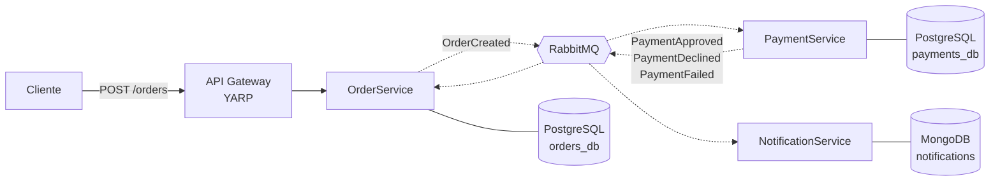

# Sistema de Pedidos — Microsserviços .NET 8 + RabbitMQ

Sistema de pedidos de e-commerce em microsserviços, comunicando-se **por eventos
assíncronos** no RabbitMQ. Um pedido é aceito na hora, cobrado em seguida, e o
cliente é notificado do resultado quando ele existir.

> **Status: em construção — 4 de 28 tarefas concluídas.**
> A fundação (infraestrutura, contratos de evento, domínio de pedidos) está de
> pé e testada. Os serviços e a mensageria estão em desenvolvimento. O
> [roadmap](#roadmap) abaixo mostra exatamente onde estou.

---

## O problema

Um cliente não pode ficar preso esperando a confirmação de um pagamento que
depende de um processador externo e pode demorar — ou nunca responder. O sistema
precisa aceitar o pedido imediatamente e resolver a cobrança depois, sem perder
nada no caminho.

Isso é um problema de **consistência eventual**, e é onde os sistemas
distribuídos costumam quebrar de formas silenciosas.

## Arquitetura

Três serviços de domínio conversam **exclusivamente por eventos**. Não há
orquestrador: cada serviço reage a fatos que já aconteceram e ninguém coordena
ninguém. Isso se chama **coreografia**.



1. O cliente cria o pedido e recebe **na hora** o identificador e a situação
   `Pending`. Não espera pelo pagamento.
2. `OrderService` persiste o pedido e publica `OrderCreated`.
3. `PaymentService` consome, decide a cobrança e publica um dos três desfechos.
4. `OrderService` consome o desfecho e move o pedido para seu estado final.
5. `NotificationService` consome o mesmo desfecho, em paralelo, e registra a
   notificação.

Nenhum serviço acessa o banco de outro. Um schema compartilhado seria um
monólito distribuído — o pior dos dois mundos.

## Decisões que sustentam o projeto

### Outbox: publicar evento e gravar no banco viram uma operação só

Salvar o pedido no PostgreSQL e publicar `OrderCreated` no RabbitMQ são duas
operações em dois sistemas diferentes. Se a segunda falha depois da primeira, o
pedido existe e **ninguém nunca fica sabendo** — o sistema fica permanentemente
inconsistente sem gerar um único erro.

O evento é gravado na mesma transação do pedido, numa tabela `outbox`, e um
processo separado publica a partir dali. Ou os dois acontecem, ou nenhum.

### Todo consumidor é idempotente

RabbitMQ garante entrega **pelo menos uma vez**. Mensagem repetida não é
hipótese remota, é garantia operacional: um `ack` perdido e a mesma mensagem
chega de novo.

Cada consumidor registra o `MessageId` no Redis e descarta em silêncio o que já
processou. Como rede de segurança final, o banco tem restrições únicas
(`payments.order_id`, `notifications.orderId`) — se o Redis cair, o sistema
continua correto.

### Falha é estado esperado, não exceção

Retry com backoff exponencial e **dead-letter queue** em todo consumidor.
Mensagem que falhou 5 vezes vai para a DLQ e gera log de erro — nunca é
descartada em silêncio, nunca fica em loop infinito de reentrega.

O domínio distingue **pagamento recusado** (o processador respondeu "não", é
decisão de negócio) de **pagamento falhou** (o processador não respondeu, é
problema técnico). Para quem dá suporte, a diferença muda a ação.

### Rastreabilidade ponta a ponta

Todo evento carrega um `CorrelationId` que nasce no gateway e atravessa a
cadeia inteira. Sem isso, depurar um fluxo assíncrono de três saltos é
adivinhação.

## Stack

| Item | Escolha |
|---|---|
| Runtime | .NET 8 (LTS) |
| Mensageria | RabbitMQ via MassTransit |
| Banco transacional | PostgreSQL + EF Core (bancos separados por serviço) |
| Banco documental | MongoDB (histórico de notificações) |
| Cache / idempotência | Redis |
| Gateway | YARP |
| Logs | Serilog estruturado, saída JSON |
| Testes | xUnit + FluentAssertions + Testcontainers |
| Orquestração local | Docker Compose |

**Por que MassTransit e não `RabbitMQ.Client` puro:** retry, DLQ, serialização e
outbox prontos e testados em produção. Escrever isso à mão consumiria o projeto
inteiro em encanamento em vez de arquitetura.

**Por que dois tipos de banco:** Orders e Payments precisam de transação e
integridade referencial. Notifications é histórico *append-only* de formato
variável por canal. A escolha vem do padrão de acesso aos dados, não de moda.

## Rodando localmente

Requisitos: Docker e .NET 8 SDK.

```bash
git clone https://github.com/rafacavalcante60/microservices-rabbitmq.git
cd microservices-rabbitmq

# Sobe RabbitMQ, PostgreSQL, MongoDB e Redis
docker compose up -d

# Testes de domínio — rodam sem infraestrutura, em milissegundos
dotnet test
```

Painel do RabbitMQ: <http://localhost:15672> (`guest` / `guest`)

> Os serviços ainda não sobem pelo Compose — isso chega na T-022.

## Estrutura

```
├── specs/                   # spec, plano e tarefas de cada feature
├── src/
│   ├── Shared.Contracts/    # contratos de evento, sem dependências
│   ├── ApiGateway/
│   ├── OrderService/        # + OrderService.Domain
│   ├── PaymentService/      # + PaymentService.Domain
│   └── NotificationService/
├── tests/
└── docker-compose.yml
```

Cada serviço segue `Api` → `Application` → `Domain` ← `Infrastructure`, com as
dependências apontando para dentro. O domínio é um **projeto separado com zero
`PackageReference`** — assim o compilador impede um `using` de EF Core nas
regras de negócio, em vez de depender da disciplina de quem escreve.

## Roadmap

| Etapa | Tarefas | Status |
|---|---|---|
| Fundação — solução, Docker Compose, contratos | T-001 → T-003 | ✅ |
| Domínio de pedidos | T-004 → T-005 | 🔨 em andamento |
| OrderService — persistência, outbox, API | T-006 → T-011 | ⬜ |
| PaymentService — regra, retry, consumidor | T-012 → T-017 | ⬜ |
| Fluxo completo ponta a ponta | T-018 | ⬜ |
| Notificações e API Gateway | T-019 → T-021 | ⬜ |
| Tudo em contêineres | T-022 | ⬜ |
| Testes de integração com Testcontainers | T-023 → T-026 | ⬜ |
| ADRs e documentação | T-027 → T-028 | ⬜ |

## Como este projeto é construído

Desenvolvimento **spec-driven**: nenhuma linha de código de produção é escrita
antes de existir uma spec aprovada e um plano derivado dela.

```
spec (o quê e por quê) → plano (como) → tarefas → código → teste verde
```

- [`specs/001-pedido-pagamento-notificacao/spec.md`](specs/001-pedido-pagamento-notificacao/spec.md) — 15 regras de negócio, 16 critérios de aceite, escrita em linguagem de negócio
- [`specs/001-pedido-pagamento-notificacao/plan.md`](specs/001-pedido-pagamento-notificacao/plan.md) — cada decisão técnica com sua justificativa **e a alternativa descartada**

Um commit por tarefa. O `git log` é o registro de como o sistema foi construído,
na ordem em que foi pensado.
