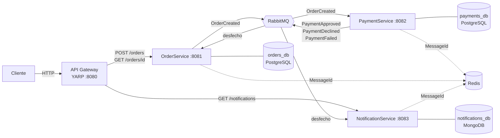
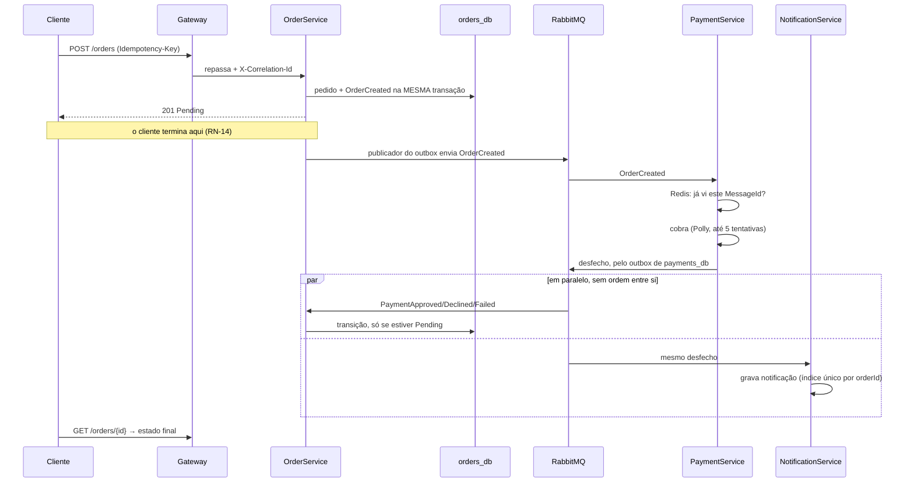

# Visão de arquitetura

Sistema de pedidos em quatro serviços .NET 8. Um pedido entra pelo gateway,
atravessa três serviços por eventos no RabbitMQ e termina com o cliente
notificado — sem que nenhum serviço chame o outro.

Para o *porquê* de cada regra, ver `CONSTITUTION.md`; para o comportamento
esperado, `specs/001-pedido-pagamento-notificacao/spec.md`.

## O desenho

Duas coisas que o diagrama afirma e valem ser ditas em voz alta:

**Nenhuma seta liga dois serviços de domínio diretamente.** Toda comunicação
entre eles passa pelo broker (princípio III). O PaymentService não sabe o
endereço do OrderService e não tem como descobri-lo.

**Cada banco pertence a um serviço só.** Não há um schema compartilhado. Um
schema compartilhado seria um monólito distribuído — o custo de operar três
serviços com o acoplamento de um só.

## O fluxo, do POST ao cliente notificado

O detalhe que costuma ser cobrado em entrevista está no `par`: os passos do
OrderService e do NotificationService são independentes e sem ordem garantida
entre si. Durante alguns milissegundos existe uma notificação de pagamento
aprovado enquanto o pedido ainda consta `Pending`. Isso é consistência eventual,
e é aceito de propósito — encadear os dois reintroduziria o acoplamento síncrono
que a arquitetura existe para evitar.

## Fronteiras de serviço

| Serviço | Responsabilidade | Dono de | Publica | Consome |
|---|---|---|---|---|
| **ApiGateway** | Borda HTTP, roteamento, nascimento do `CorrelationId` | — | — | — |
| **OrderService** | Ciclo de vida do pedido | `orders_db` | `OrderCreated` | os três desfechos |
| **PaymentService** | Decisão de cobrança | `payments_db` | `PaymentApproved`, `PaymentDeclined`, `PaymentFailed` | `OrderCreated` |
| **NotificationService** | Histórico de notificações | `notifications_db` | — | os três desfechos |

Contratos de mensagem vivem em `Shared.Contracts`: `record` imutável, nome no
passado porque descrevem fato consumado, mudanças aditivas (princípio VIII).
`BuildingBlocks` reúne o que é infraestrutura comum — filtro de idempotência,
health checks e `CorrelationId`.

Cada serviço se organiza em `Api` → `Application` → `Domain`, com
`Infrastructure` de fora para dentro. As dependências apontam para o centro:
`Domain` não conhece EF, Mongo nem MassTransit.

## Filas e exchanges

Cada evento tem um exchange (o tipo da mensagem) e uma fila por serviço
consumidor, nomeada com prefixo:

| Evento | Filas |
|---|---|
| `OrderCreated` | `payments-order-created` |
| `PaymentApproved` | `orders-payment-approved`, `notifications-payment-approved` |
| `PaymentDeclined` | `orders-payment-declined`, `notifications-payment-declined` |
| `PaymentFailed` | `orders-payment-failed`, `notifications-payment-failed` |

O prefixo por serviço não é cosmético. Sem ele, o MassTransit nomearia a fila só
pelo tipo da mensagem e os dois serviços que assinam o mesmo desfecho cairiam na
mesma fila: viram *competing consumers*, e cada evento chegaria a só um dos dois
— a notificação simplesmente não existiria para metade dos pedidos.

Cada fila tem sua `_error` (DLQ). Mensagem que falha três vezes vai para lá com
log; nunca é descartada, nunca entra em loop infinito (princípio VI).

## Os padrões, e o que quebra sem cada um

| Padrão | Onde | O que quebra sem ele |
|---|---|---|
| **Outbox** | Order e Payment, ao publicar | Pedido gravado cujo evento nunca saiu: `Pending` para sempre, sem erro nenhum. Ver [ADR 0001](decisions/0001-outbox.md) |
| **Idempotência de consumidor** | `IdempotencyFilter`, Redis | Reentrega do broker vira segunda cobrança no cartão do cliente |
| **Idempotência de criação** | Índice único `(customer_id, idempotency_key)` | Cliente que clica duas vezes compra duas vezes |
| **Retry + DLQ** | MassTransit, 3 tentativas | Falha passageira de infraestrutura vira pedido travado, ou mensagem em loop infinito |
| **Retry do gateway** | Polly, até 5 tentativas | Instabilidade de terceiro vira `PaymentFailed` que não precisava acontecer |
| **CorrelationId** | Da borda até o último log | Depurar um fluxo assíncrono de três saltos passa a ser adivinhação |
| **Health checks** | `/health` e `/health/ready` | Orquestrador manda tráfego para serviço que ainda não alcança suas dependências |

Os dois retries são distintos de propósito, e confundi-los é o erro clássico: o
**Polly** trata o gateway de terceiro que não respondeu, que é caso de negócio
previsto (RN-11) e termina em `PaymentFailed` com o cliente avisado; o
**MassTransit** trata o nosso banco que caiu, que é defeito de infraestrutura e
termina na DLQ. Um retry só mascararia um PostgreSQL fora do ar como "pagamento
falhou" — e o cliente receberia notificação de falha por um problema que não é
dele.

## Rastreabilidade

O `CorrelationId` nasce no gateway (do header `X-Correlation-Id` ou gerado),
segue no header até o OrderService e, a partir do `OrderCreated`, viaja dentro
de cada evento. Todo log dos três serviços sai carimbado com ele, em JSON
estruturado (Serilog).

É a passagem do mundo síncrono para o assíncrono: depois do `201`, o header
acabou e só o campo no contrato liga o POST do cliente aos logs de dois saltos
adiante.

## Como isso é verificado

Os testes de integração sobem RabbitMQ, PostgreSQL, MongoDB e Redis reais em
contêineres descartáveis (Testcontainers) e exercitam o fluxo inteiro pelos três
serviços — inclusive os caminhos ruins: chave repetida, evento reentregue,
gateway fora do ar e broker derrubado no meio da criação.

Broker falso não serviria: o que costuma quebrar em mensageria não é a lógica do
consumidor, é a serialização do contrato, o nome da fila e o roteamento do
exchange — justamente o que um mock não exercita.
